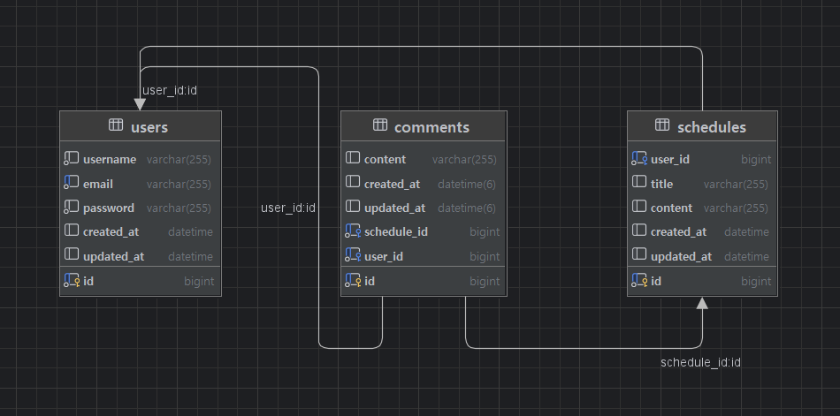

# java-schedule-manager-develop

## 1. ERD


User 1개 ↔ Schedule 다수 (OneToMany)
User 1개 ↔ Comment 다수 (OneToMany)
Schedule 1개 ↔ Comment 다수 (OneToMany)

## 2. API 명세

Base URL : http://localhost:8080

### 1. 회원(User) API

#### 1.1 회원가입
POST /register

Request Body

```json
{
"username": "홍길동",
"email": "hong@example.com",
"password": "password123"
}
```

Validation
* username: 필수, 2~4글자
* email: 필수, 이메일 형식
* password: 필수, 최소 8글자

Response (201 Created)
```json
{
"id": 1
}
```

Error (400 Bad Request)
```json
{
"username": "유저명은 2~4글자여야 합니다.",
"email": "올바른 이메일 형식이 아닙니다."
}
```

```json
{
"message": "이미 존재하는 이메일입니다."
}
```

#### 1.2 로그인
POST /login

Request Body
```json
{
"email": "hong@example.com",
"password": "password123"
}
```

Validation
* email: 필수, 이메일 형식
* password: 필수

Response (200 OK)
```json
{
"id": 1,
"email": "hong@example.com"
}
```

Error (400 Bad Request)
```json
{
"message": "이메일 또는 비밀번호가 일치하지 않습니다."
}
```
참고: 로그인 성공 시 세션에 사용자 정보가 저장됩니다.

#### 1.3 로그아웃
POST /logout

Response (204 No Content)

Error (400 Bad Request)
```json
{
"message": "로그인되지 않은 사용자입니다."
}
```

#### 1.4 단건 조회
GET /users/{userId}

Path Variable
* userId: 유저 ID

Response (200 OK)
```json
{
"id": 1,
"name": "홍길동",
"email": "hong@example.com"
}
```

Error (400 Bad Request)
```json
{
"message": "존재하지 않는 유저입니다."
}
```

#### 1.5 전체 조회
GET /users

Response (200 OK)
```json
[
{
"id": 1,
"name": "홍길동",
"email": "hong@example.com"
},
{
"id": 2,
"name": "김철수",
"email": "kim@example.com"
}
]
```

#### 1.6 수정
PUT /users/{userId}

Path Variable
* userId: 유저 ID

Request Body
```json
{
"username": "홍길동",
"email": "newemail@example.com"
}
```

Validation
* username: 선택, 2~4글자
* email: 선택, 이메일 형식

Response (200 OK)
```json
{
"id": 1,
"username": "홍길동",
"email": "newemail@example.com"
}
```

Error (400 Bad Request)
```json
{
"message": "이미 존재하는 이메일입니다."
}
```

#### 1.7 삭제
DELETE /users/{userId}

Path Variable
* userId: 유저 ID

Response (204 No Content)

Error (400 Bad Request)
```json
{
"message": "존재하지 않는 유저입니다."
}
```
참고: 유저 삭제 시 연관된 모든 일정과 댓글도 자동 삭제됩니다 (CASCADE)

### 2. 일정(Schedule) API

#### 2.1 일정 생성
POST /schedules

Request Body
```json
{
"userId": 1,
"title": "회의",
"content": "프로젝트 회의 진행"
}
```

Validation
* userId: 필수
* title: 필수, 최대 10글자
* content: 필수, 최대 200글자

Response (201 Created)
```json
{
"id": 1,
"userId": 1,
"username": "홍길동",
"title": "회의",
"content": "프로젝트 회의 진행"
}
```

Error (400 Bad Request)
```json
{
"title": "일정 제목은 10글자 이내여야 합니다.",
"content": "일정 내용은 200글자 이내여야 합니다."
}
```

```json
{
"message": "존재하지 않는 유저입니다."
}
```

#### 2.2 단건 조회
GET /schedules/{scheduleId}

Path Variable
* scheduleId: 일정 ID

Response (200 OK)
```json
{
"id": 1,
"userId": 1,
"name": "홍길동",
"title": "회의",
"content": "프로젝트 회의 진행"
}
```

Error (400 Bad Request)
```json
{
"message": "존재하지 않는 일정입니다."
}
```

#### 2.3 전체 조회
GET /schedules

Response (200 OK)
```json
[
{
"id": 1,
"userId": 1,
"name": "홍길동",
"title": "회의",
"content": "프로젝트 회의 진행"
},
{
"id": 2,
"userId": 2,
"name": "김철수",
"title": "개발",
"content": "기능 개발"
}
]
```

#### 2.4 페이지네이션 조회
GET /schedules/page?page=0&size=10

Query Parameters
* page: 페이지 번호 (default: 0)
* size: 페이지 크기 (default: 10)

Response (200 OK)
```json
{
"content": [
{
"id": 1,
"title": "회의",
"content": "프로젝트 회의 진행",
"commentCount": 3,
"createdAt": "2026-01-01T10:00:00",
"updatedAt": "2026-01-01T15:00:00",
"username": "홍길동"
}
],
"pageable": {
"pageNumber": 0,
"pageSize": 10
},
"totalPages": 5,
"totalElements": 50,
"last": false,
"first": true,
"numberOfElements": 10
}
```
정렬: 수정일(updatedAt) 내림차순

#### 2.5 수정
PUT /schedules/{scheduleId}

Path Variable
* scheduleId: 일정 ID

Request Body
``` json
{
"title": "수정된 회의",
"content": "수정된 내용"
}
```

Validation
* title: 선택, 최대 10글자
* content: 선택, 최대 200글자

Response (200 OK)
```json
{
"id": 1,
"userId": 1,
"name": "홍길동",
"title": "수정된 회의",
"content": "수정된 내용"
}
```

Error (400 Bad Request)
```json
{
"message": "존재하지 않는 일정입니다."
}
```

#### 2.6 삭제
DELETE /schedules/{scheduleId}

Path Variable
* scheduleId: 일정 ID

Response (204 No Content)

Error (400 Bad Request)
```json
{
"message": "존재하지 않는 일정입니다."
}
```
참고: 일정 삭제 시 연관된 모든 댓글도 자동 삭제됩니다 (CASCADE)

### 3. 댓글(Comment) API
#### 3.1 댓글 작성
POST /comments
Request Body
```json
{
"userId": 1,
"scheduleId": 1,
"content": "좋은 일정이네요!"
}
```

Validation
* userId: 필수
* scheduleId: 필수
* content: 필수

Response (201 Created)
```json
{
"id": 1,
"userId": 1,
"username": "홍길동",
"scheduleId": 1,
"content": "좋은 일정이네요!",
"createdAt": "2026-01-01T10:00:00"
}
```

Error (400 Bad Request)
```json
{
"content": "댓글 내용은 필수입니다."
}
```

```json
{
"message": "존재하지 않는 유저입니다."
}
```

```json
{
"message": "존재하지 않는 일정입니다."
}
```

#### 3.2 전체 댓글 조회
GET /comments

Response (200 OK)
```json
[
{
"id": 1,
"userId": 1,
"username": "홍길동",
"scheduleId": 1,
"content": "좋은 일정이네요!",
"createdAt": "2026-01-01T10:00:00",
"updatedAt": "2026-01-01T10:00:00"
}
]
```

#### 3.3 특정 일정의 댓글 조회
GET /schedules/{scheduleId}/comments

Path Variable
* scheduleId: 일정 ID

Response (200 OK)
```json
[
{
"id": 1,
"userId": 1,
"username": "홍길동",
"scheduleId": 1,
"content": "좋은 일정이네요!",
"createdAt": "2026-01-01T10:00:00",
"updatedAt": "2026-01-01T10:00:00"
},
{
"id": 2,
"userId": 2,
"username": "김철수",
"scheduleId": 1,
"content": "참석하겠습니다.",
"createdAt": "2026-01-01T11:00:00",
"updatedAt": "2026-01-01T11:00:00"
}
]
```

Error (400 Bad Request)
```json
{
"message": "존재하지 않는 일정입니다."
}
```

## 기술 스택
Framework: Spring Boot 3.3.6

ORM: JPA/Hibernate

Database: MySQL

Validation: Jakarta Validation API

Auditing: Spring Data JPA Auditing

Security: BCrypt (비밀번호 암호화)

Session: Spring Session